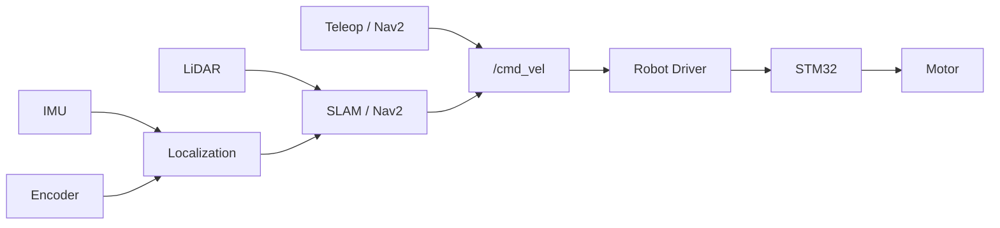

# ROS2 Autonomous Mobile Robot Platform

基于 ROS 2 Humble 的自主移动机器人真机项目，运行于 Intel NUC13。

项目目标是完成底盘控制、传感器接入、状态估计、SLAM 建图、定位与 Nav2 自主导航，并在此基础上进一步扩展动态避障、视觉感知与智能导航功能。

## 系统架构



## 项目结构

```text
## 项目结构

```text
ramr_ws/
├── src/
│   ├── ramr_bringup/
│   ├── ramr_localization/
│   ├── ramr_navigation/
│   ├── ramr_perception/
│   └── vendor/
├── README.md
├── COMMANDS.md
└── .gitignore
```

其中：

- `ramr_*`：项目自定义功能包
- `vendor/`：WHEELTEC 官方源码及第三方依赖
```

## 项目阶段

| Task | 功能 | 状态 |
|---|---|---|
| Task 1 | 真机底盘驱动接入 | 已完成 |
| Task 2 | 键盘控制与运动验证 | 已完成 |
| Task 3 | LiDAR、IMU、Odometry 与 TF 验证 | 进行中 |
| Task 4 | 状态估计与传感器融合 | 未开始 |
| Task 5 | SLAM 建图 | 未开始 |
| Task 6 | 地图保存与管理 | 未开始 |
| Task 7 | Nav2 定位与自主导航 | 未开始 |
| Task 8 | 真机导航参数优化 | 未开始 |
| Task 9 | 动态避障与复杂环境导航 | 未开始 |
| Task 10 | 视觉感知与智能导航 | 未开始 |

## 当前进展

目前已完成 WHEELTEC 真机底盘驱动接入，Intel NUC13 可以正常与 STM32 控制器通信。

已完成 `/cmd_vel` 控制链路验证，可以通过键盘控制机器人完成前进、后退、转向和停止。

当前正在进行 LiDAR、IMU、Odometry 和 TF 验证，为后续状态估计、SLAM 和 Nav2 自主导航提供基础数据。

## 使用方法

各阶段运行、测试与调试指令见：

`COMMANDS.md`