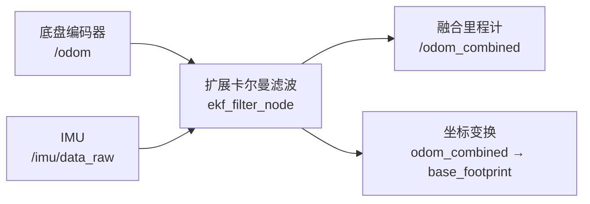

# ROS2 Autonomous Mobile Robot Platform

基于 ROS 2 Humble 的自主移动机器人真机项目，运行于 Intel NUC13，底层采用 WHEELTEC 移动底盘与 STM32 控制器。

项目目标是完成底盘控制、传感器接入、状态估计、SLAM 建图、定位与 Nav2 自主导航，并进一步扩展动态避障、视觉感知和智能导航功能。

## 系统架构

当前状态估计系统融合轮式里程计与 IMU 数据，输出机器人连续运动状态。



- `/odom`：提供编码器计算的前进速度、横向速度约束和旋转速度。
- `/imu/data_raw`：提供机器人朝向和旋转角速度。
- `ekf_filter_node`：根据配置和协方差融合里程计与 IMU 数据。
- `/odom_combined`：输出融合后的机器人位置、速度和朝向。
- `/tf`：发布状态估计所需的动态坐标变换。

当前主要数据链路：

```text
编码器里程计 + IMU → EKF → /odom_combined
```

不同状态信息的主要来源如下：

| 状态信息 | 主要来源 | 辅助来源 |
|---|---|---|
| 线速度 | 编码器 | IMU |
| 旋转角速度 | IMU陀螺仪 | 左右轮速度差 |
| 短时间相对位置 | 编码器里程计 | IMU |
| 朝向变化 | IMU与编码器 | 雷达SLAM |
| 地图中的全局位置 | 雷达与地图 | 编码器和IMU |

## 项目结构

```text
ramr_ws/
├── src/
│   ├── ramr_bringup/
│   ├── ramr_localization/
│   ├── ramr_navigation/
│   ├── ramr_perception/
│   └── vendor/
├── README.md
├── COMMANDS.md
└── .gitignore
```

- `ramr_bringup`：机器人基础系统统一启动。
- `ramr_localization`：状态估计、建图和定位配置。
- `ramr_navigation`：Nav2导航与参数配置。
- `ramr_perception`：雷达、相机及视觉感知功能。
- `vendor`：WHEELTEC官方源码及第三方依赖。

## 项目阶段

| Task | 功能 | 状态 |
|---|---|---|
| Task 1 | 真机底盘驱动接入 | 已完成 |
| Task 2 | 键盘控制与运动验证 | 已完成 |
| Task 3 | LiDAR、Camera、IMU、Odometry与TF验证 | 已完成 |
| Task 4 | EKF状态估计与传感器融合 | 已完成 |
| Task 5 | SLAM建图 | 未开始 |
| Task 6 | 地图保存与管理 | 未开始 |
| Task 7 | Nav2定位与自主导航 | 未开始 |
| Task 8 | 真机导航参数优化 | 未开始 |
| Task 9 | 动态避障与复杂环境导航 | 未开始 |
| Task 10 | 视觉感知与智能导航 | 未开始 |

## 当前进展

目前已完成底盘驱动、键盘控制、传感器与TF验证，并建立独立的EKF状态估计配置。

`ramr_bringup` 负责统一启动底盘驱动、机器人模型、关节状态发布和状态估计节点。融合里程计 `/odom_combined` 的输出频率约为10 Hz，当前系统中仅运行一个EKF节点。

激光雷达和摄像头已经分别完成硬件与数据验证，后续将加入对应功能的统一启动流程。

下一阶段将开展实机SLAM建图与地图保存测试。

## 使用方法

构建工作空间：

```bash
cd ~/ramr_ws
colcon build --symlink-install
source install/setup.bash
```

启动机器人基础系统：

```bash
ros2 launch ramr_bringup robot_bringup.launch.py
```

详细的运行、测试和调试指令见：`COMMANDS.md`
